# Related Patterns & Concepts - Throwaway Code Agents

## Core Overlapping Concepts

### 1. **Dynamic Tool Generation**

The concept where agents create their own tools at runtime rather than using predefined ones.

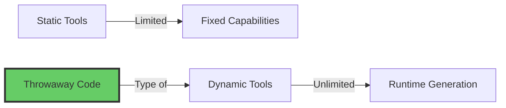

**Key Papers/Projects:**
- OpenAI's o3-mini with dynamic tool generation
- Docker-based code execution with agent separation

**Related Patterns:**
- **Plugin Architecture** - Runtime extension loading
- **Metaprogramming** - Code that writes code
- **Hot Code Reloading** - Dynamic code updates without restart
- **Reflection/Introspection** - Programs examining themselves

---

### 2. **Code Interpreter Pattern**

Code interpreters in AI translate natural language prompts into executable code and run it, versus just generating code.

**Distinction:**
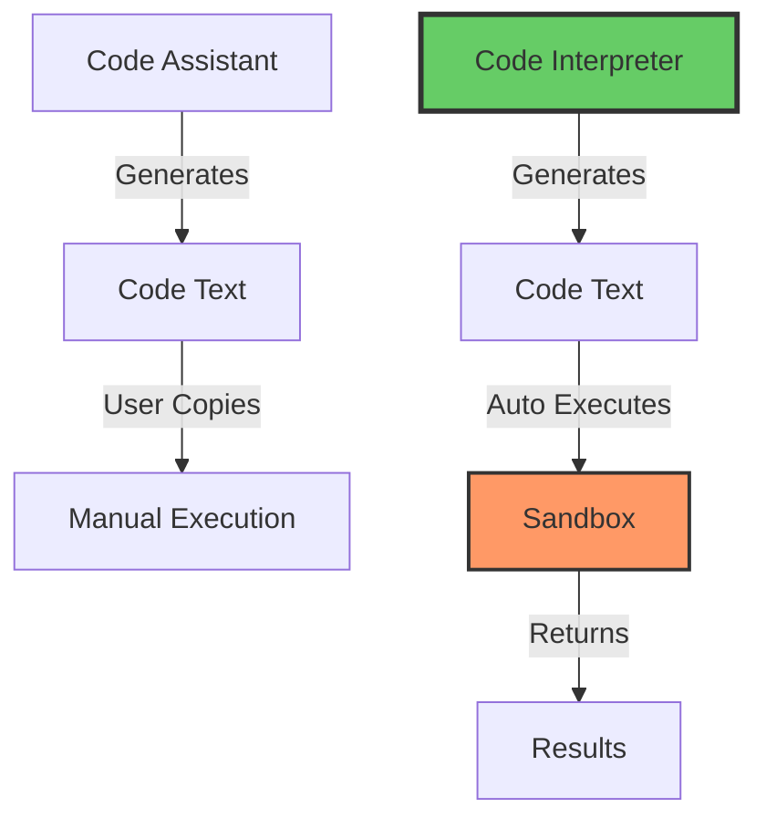

**Examples:**
- ChatGPT's Code Interpreter plugin - executes code and creates files
- Open Interpreter - controls computer via terminal
- Autogen agents - execute code to visualize data as charts
- Open Interpreter runs code locally with full system access

**Related Patterns:**
- **REPL (Read-Eval-Print Loop)** - Interactive code execution
- **Jupyter Notebooks** - Cell-based interactive computing
- **Live Coding** - Real-time code execution and modification
- **Eval/Apply Pattern** - Core of Lisp interpreters

---

### 3. **Natural Language Programming**

CoRE uses LLM as interpreter to execute natural language instructions, unifying natural language, pseudo-code, and flow programming.

**Evolution of Programming Abstraction:**
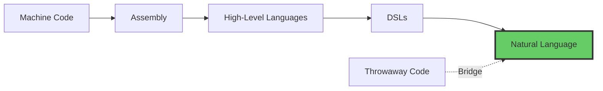

**Key Insight:**
Natural language programming follows the trend toward increased usability, readability, and democracy of programming.

**Related Concepts:**
- **Intent-Based Systems** - Specify what, not how
- **Declarative Programming** - Describe desired outcome
- **End-User Programming** - Non-programmers creating software
- **Low-Code/No-Code** - Visual programming for non-developers

---

### 4. **Sandbox Security Models**

All throwaway code systems require isolated execution environments.

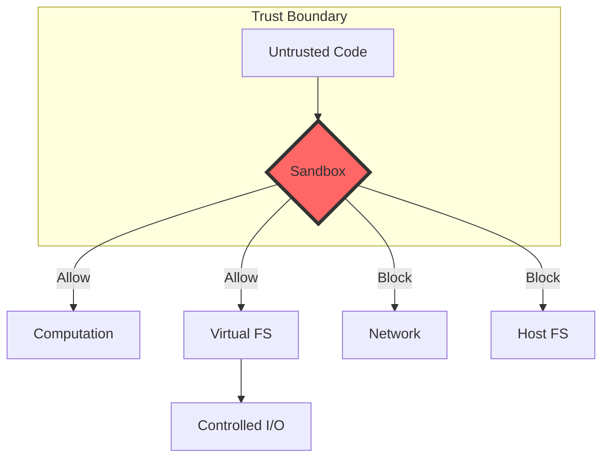

**Implementations:**
- **WebAssembly/WASM** - Pyodide's foundation
- **Docker Containers** - Secure environment with restricted resource access, no network
- **V8 Isolates** - JavaScript sandboxing (Cloudflare Workers)
- **gVisor** - Application kernel for containers
- **Firecracker** - Micro-VMs for secure cloud sandboxes

**Related Patterns:**
- **Principle of Least Privilege**
- **Defense in Depth**
- **Capability-Based Security**
- **Process Isolation**
- **Jail/Chroot**

---

### 5. **Multi-Agent Orchestration**

Separation of File Access Agent and Code Generator/Executor Agent is crucial for security.

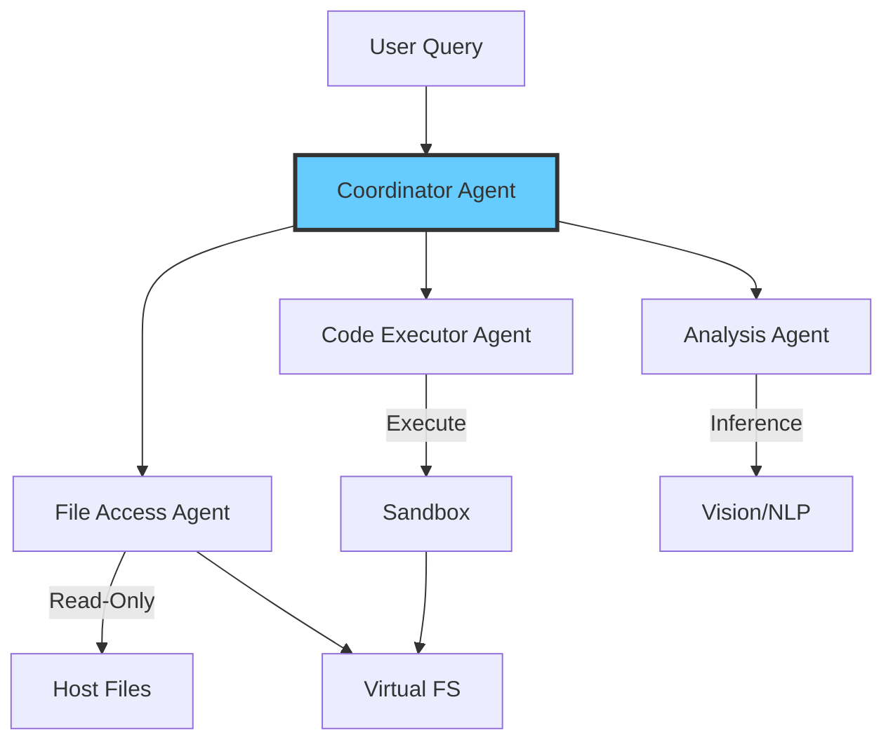

**Related Frameworks:**
- AutoGen - multi-agent framework with code interpreters in Docker/Jupyter
- **CrewAI** - Role-based agent collaboration
- **LangGraph** - Graph-based agent orchestration
- **CAMEL** - Communicative agents for task solving

**Related Patterns:**
- **Actor Model** - Concurrent computation with message passing
- **Microservices** - Distributed system architecture
- **Orchestration vs Choreography** - Centralized vs distributed coordination
- **Publish-Subscribe** - Event-driven communication

---

### 6. **Durable/Persistent Execution**

Long-running agent tasks need checkpoint/resume capabilities.

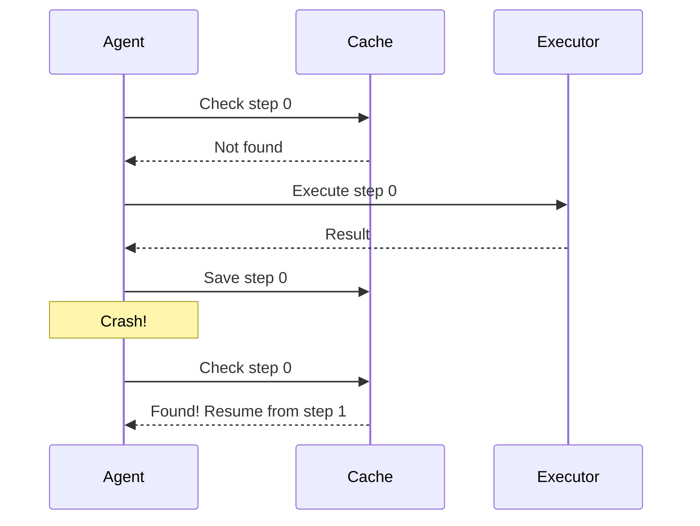

**Related Systems:**
- **Temporal.io** - Durable workflow orchestration
- **Restate** - Durable execution platform
- **AWS Step Functions** - Serverless workflows
- **Dask** - Distributed computing with checkpoints

**Related Patterns:**
- **Saga Pattern** - Distributed transactions with compensation
- **Event Sourcing** - Rebuild state from events
- **Command Query Responsibility Segregation (CQRS)**
- **Write-Ahead Logging (WAL)**
- **Checkpointing** - Scientific computing pattern

---

### 7. **Interactive Development Environments**

The Jupyter-like nature of code interpreter agents.

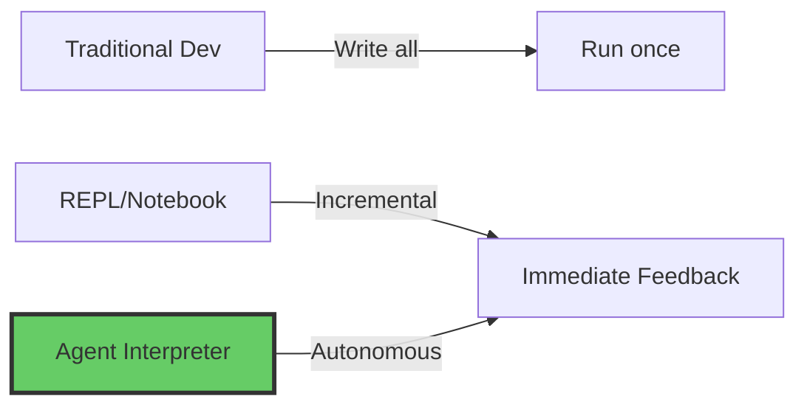

**Related Tools:**
- Jupyter notebooks with running servers for LLM code execution
- **Observable** - Reactive notebooks
- **Pluto.jl** - Reactive Julia notebooks
- **Wolfram Notebooks** - Symbolic computation
- **Livebook** - Elixir notebooks

**Related Concepts:**
- **Literate Programming** - Code as documentation
- **Computational Notebooks** - Mix code, output, narrative
- **Interactive Computing** - Exploration-driven development
- **Exploratory Data Analysis (EDA)** - Iterative investigation

---

### 8. **Program Synthesis**

Automatically generating programs from specifications.

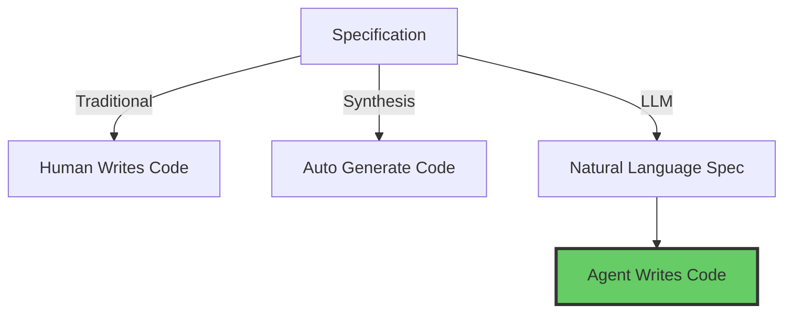

**Academic Foundations:**
- **Inductive Program Synthesis** - Learn from examples
- **Deductive Synthesis** - Derive from formal specs
- **Sketch-Based Synthesis** - Fill in missing parts
- **Neural Program Synthesis** - ML-based generation

**Related Research:**
- **CodeT** - Program synthesis with testing
- **AlphaCode** - Competition-level code generation
- **CodeLlama** - Specialized code models

---

### 9. **Tool Use & Function Calling**

The foundation that enables agents to execute code.

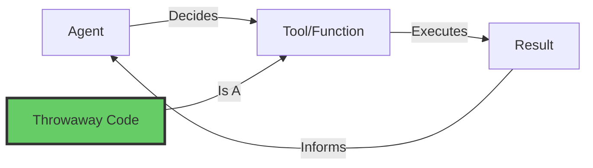

**Evolution:**
```
Static Tools → Dynamic Tools → Code Generation
    ↓              ↓                ↓
  Limited     Semi-Flexible    Unlimited
```

**Related Concepts:**
- **Function Calling** - LLM structured outputs
- **Tool Learning** - Agents learning to use tools
- **Reflexion** - Self-reflection for improvement
- **ReAct** - Reasoning + Acting paradigm

---

### 10. **Virtual File Systems**

Abstraction layer providing controlled resource access.

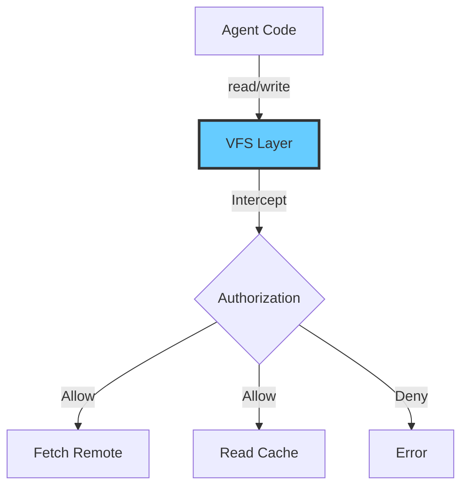

**Historic Examples:**
- **Plan 9** - Everything is a file
- **/proc in Linux** - Process info as files
- **FUSE** - Filesystem in userspace
- **WebDAV** - Web-based file system

**Modern Applications:**
- **s3fs/rclone** - Cloud storage mounting
- **IPFS** - Distributed file system
- **Union/Overlay FS** - Layered filesystems (Docker)

**Related Patterns:**
- **Virtual File System (VFS)** - OS abstraction
- **Proxy Pattern** - Controlled access
- **Facade Pattern** - Simplified interface
- **Adapter Pattern** - Interface conversion

---

## Cross-Domain Pattern Categories

### A. **Execution Isolation Patterns**

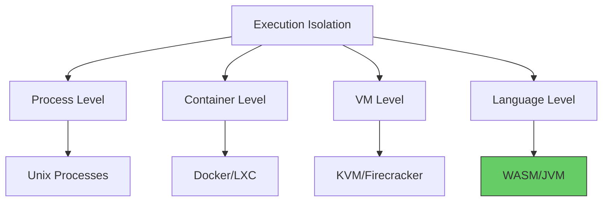

**Throwaway Code Uses:** Language-level (WASM/Pyodide)

### B. **Code-Data Duality Patterns**

Programs that treat code as data:

- **Homoiconicity** - Code is data (Lisp, Julia)
- **Reflection** - Programs examining themselves
- **Metaprogramming** - Programs writing programs
- **Macros** - Code transformation at compile time
- **JIT Compilation** - Runtime code generation

**Throwaway Code Connection:** LLMs generate code as data, then execute it.

### C. **Async-Sync Bridging Patterns**

Making async operations appear synchronous:

```python
# Pattern from throwaway code
Atomics.wait(signal, 0, 0)  # Block until ready

# Similar patterns:
# - Python: asyncio.run() 
# - Rust: block_on()
# - JavaScript: await
# - Go: <-channel blocking receive
```

**Related Concepts:**
- **Green Threads** - User-space threads
- **Fibers/Coroutines** - Cooperative multitasking
- **Continuations** - First-class control flow
- **Promises/Futures** - Async value containers

### D. **Capability Patterns**

Systems that grant specific permissions:

1. **Capability-Based Security** - Unforgeable tokens
2. **Object Capabilities** - Reference = permission
3. **Ambient Authority** - Implicit permissions (avoid this)

**Throwaway Code:** Virtual FS provides capabilities through mount points.

### E. **Observability Patterns**

Monitoring and debugging agent behavior:

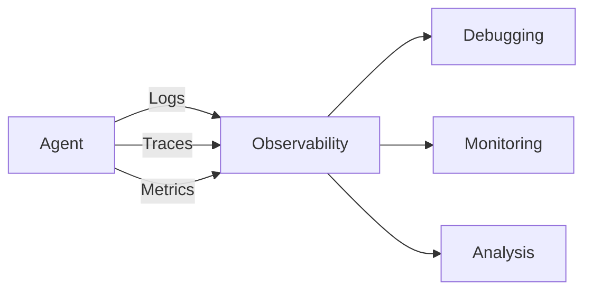

**Related Concepts:**
- **Distributed Tracing** - OpenTelemetry, Jaeger
- **Structured Logging** - Machine-readable logs
- **Profiling** - Performance analysis
- **Replay Debugging** - Record/replay execution

---

## Emerging Patterns

### 1. **Agent-Oriented Programming (AOP)**

Programming paradigm where LLM serves as interpreter for natural language agent programs.

**Characteristics:**
- Agents as first-class citizens
- Message-passing communication
- Autonomous goal-seeking
- Environmental interaction

### 2. **Agentic Workflows**

Multi-agent interaction where agents collaborate by sending code and task messages.

**Components:**
- **Planning** - Break down complex tasks
- **Execution** - Run sub-tasks
- **Reflection** - Evaluate results
- **Iteration** - Refine approach

### 3. **Code-First Tool Definition**

Instead of:
```yaml
# YAML tool definition
name: weather_api
params:
  location: string
```

Use:
```python
# Code as tool
def get_weather(location):
    return requests.get(f"api.weather/{location}")
```

**Benefits:**
- More expressive
- Composable
- Type-safe (with typing)
- Familiar to LLMs

### 4. **Evaluation Frameworks**

CIBench evaluates LLMs using metrics like Tool Call Rate, Executable Rate, Numeric Accuracy, and Visualization Score.

**Metrics for Code Interpreters:**
- Tool call correctness
- Code executability
- Output accuracy (numeric, text, visual)
- Multi-turn coherence

---

## Conceptual Overlaps by Domain

### Systems Programming
- Process isolation
- Memory management
- Resource limits
- System calls

### Programming Languages
- Interpreters vs compilers
- Type systems
- Memory models
- Execution models

### Distributed Systems
- Consensus protocols
- Fault tolerance
- State management
- Communication patterns

### Security
- Sandboxing
- Capability systems
- Trust boundaries
- Attack surface reduction

### Software Engineering
- Plugin architectures
- Dependency injection
- Inversion of control
- Clean architecture

### AI/ML
- Agent architectures
- Tool learning
- In-context learning
- Reasoning patterns

---

## Related Academic Work

### Program Synthesis
- **PROSE** - Microsoft's program synthesis framework
- **FlashFill** - Excel's pattern-based synthesis
- **Rosette** - Solver-aided programming

### Autonomous Agents
- **SOAR** - Cognitive architecture
- **BDI** - Belief-Desire-Intention model
- **Subsumption Architecture** - Reactive agents

### Code Generation
- **GitHub Copilot** - IDE code completion
- **Codex** - GPT for code
- **InCoder** - Fill-in-the-middle generation

---

## Industry Implementations

### Commercial Products
- **ChatGPT Advanced Data Analysis** - Code interpreter in ChatGPT
- **Claude Artifacts** - Executable code generation
- **Google Colab with Gemini** - AI-assisted notebooks
- **Replit AI** - AI pair programmer

### Open Source
- Open Interpreter - Natural language interface for computers
- **E2B Code Interpreter SDK** - Secure cloud sandbox for code execution
- **LangChain** - Agent orchestration framework
- **AutoGen** - Microsoft's multi-agent framework

---

## Design Space Exploration

### Spectrum of Code Generation Approaches

```
Static     Semi-Dynamic      Fully Dynamic
  ↓             ↓                 ↓
Fixed      Generated         Throwaway
Tools      Templates          Code
  ↓             ↓                 ↓
Safe       Balanced          Flexible
Slow       Medium            Fast
Limited    Moderate          Unlimited
```

### Trust vs Capability Trade-off

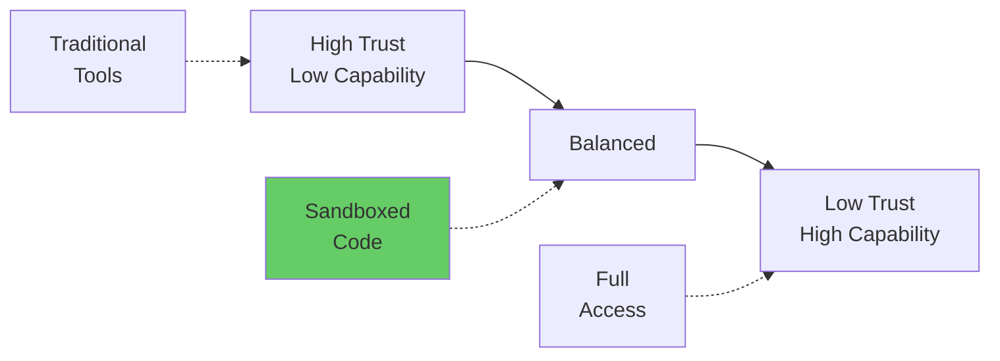

### Execution Environment Choices

| Environment | Isolation | Performance | Complexity |
|-------------|-----------|-------------|------------|
| Direct | None | Fast | Simple |
| Docker | Process | Medium | Medium |
| WASM | Strong | Fast | Low |
| Cloud VM | VM | Slow | High |

---

## Future Directions

### 1. **Hybrid Approaches**
- Static tools for common tasks
- Dynamic code for novel tasks
- Best of both worlds

### 2. **Formal Verification**
- Prove code safety before execution
- Type-level constraints
- Symbolic execution

### 3. **Learning from Execution**
- Cache successful code patterns
- Learn user preferences
- Optimize over time

### 4. **Distributed Sandboxes**
- Parallel execution
- Load balancing
- Geo-distributed compute

### 5. **Specialized Runtimes**
- Domain-specific languages
- Optimized libraries
- Hardware acceleration

---

## Key Takeaways

1. **Throwaway code bridges multiple paradigms:**
   - Natural language → Code
   - Dynamic tool generation
   - Sandboxed execution

2. **Core enabling technologies:**
   - WebAssembly/WASM
   - Modern LLMs
   - Container/sandbox tech

3. **Critical patterns:**
   - Isolation for security
   - VFS for controlled I/O
   - Durable execution for reliability

4. **Trade-offs matter:**
   - Safety vs Capability
   - Flexibility vs Performance
   - Complexity vs Simplicity

5. **Emerging best practices:**
   - Separate concerns (file access vs execution)
   - Multi-agent orchestration
   - Comprehensive evaluation metrics
